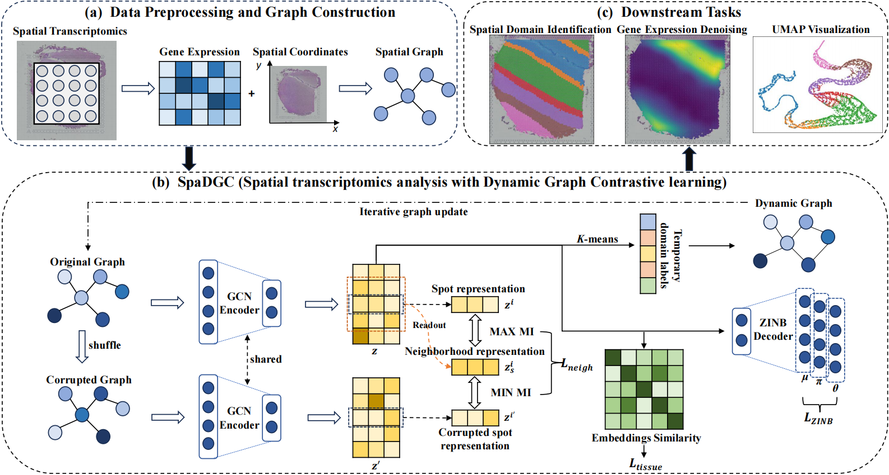

# SpaDGC: A Dynamic Graph Contrastive Learning Framework for Spatial Transcriptomics Analysis
The official implementation of the paper **"Zhiwen Xu, Haoang Chi, Xiaoming Yan, Tao Yang, Juan Chen, Chengkun Wu, and Liyang Xu. SpaDGC: A Dynamic Graph Contrastive Learning Framework for Spatial Transcriptomics Analysis"** (Accepted by BIBM 2026). 

SpaDGC is a self-supervised dynamic graph contrastive learning framework for spatial transcriptomics (ST) analysis. It learns spot representations through a **graph autoencoder (GAE)** — a GCN encoder paired with a **zero-inflated negative binomial (ZINB)** decoder — trained with **dual-scale contrastive learning** and a **dynamic graph updating (DGU)** strategy that iteratively refines the adjacency graph to sharpen domain boundaries and capture long-range intra-domain dependencies.



## Highlights

- **GAE with ZINB decoder** — a two-layer GCN encoder produces neighborhood-aware spot embeddings; a ZINB decoder reconstructs the *raw* gene-expression counts to model overdispersion and drop-out (`L_ZINB`).
- **Dual-scale contrastive learning** — a *neighborhood-level* loss (`L_neigh`) maximizes agreement between each spot and its local neighborhood summary against a feature-corrupted negative view, while a *tissue-level* loss (`L_tissue`) pulls connected spots together and pushes unconnected spots apart.
- **Dynamic graph updating (DGU)** — after a warm-up phase, the graph is rebuilt from the *initial* spatial topology at fixed intervals using temporary K-means labels: *boundary spots* (spots with spatial neighbors in a different cluster) are detected, intra-cluster edges are strengthened and cross-cluster edges weakened via cosine-similarity re-weighting, and long-range edges are added to top-*k* same-cluster spots. (Compatible with Louvain/Leiden as alternative clustering.)
- **Two-phase training** — warm-up (`L_ZINB` + `L_neigh` only) followed by refinement (`L_tissue` enabled, graph regenerated every `T_update` epochs), ending with K-means spatial-domain assignment. Total loss: `L = L_ZINB + α·L_neigh + β·L_tissue` (α = β = 0.1 after warm-up).

## Repository Structure

```
spadgc/
├── doc/
│   └── spadgc.png            # Architecture overview figure
├── res/
│   └── output_label/         # Spatial-domain predictions of SpaDGC and baselines
└── src/                      # SpaDGC source code (importable Python package)
    ├── data.py               #   Data loading & preprocessing, spatial graph construction
    ├── net.py                #   Model: GCN encoder + ZINB decoder + contrastive head
    ├── train.py              #   Training loop with dynamic graph updating
    └── utils.py              #   Clustering (mclust/kmeans/leiden/louvain) & refinement
```

## Requirements

- Python 3.11+
- PyTorch (with CUDA for GPU training)
- [PyTorch Geometric](https://pytorch-geometric.readthedocs.io/) — `GCNConv`
- [scanpy](https://scanpy.readthedocs.io/)
- [POT](https://pythonot.github.io/) (`import ot`) — pairwise distance for graph construction
- scikit-learn, tqdm, matplotlib, pandas, numpy, scipy
- *Optional:* [rpy2](https://rpy2.github.io/) + R package `mclust` — only needed if you cluster with `method='mclust'`

## Usage

### 1. Load and preprocess data

`Load10xAdata` handles raw 10x Visium folders; `LoadAdata` handles pre-saved `.h5ad` files. Set `tech='visium'` for radius-based Visium graphs, otherwise a *k*-NN graph is built (used for high-resolution platforms such as Stereo-seq).

```python
from src.data import Load10xAdata

adata = Load10xAdata(
    path='data/151507',
    n_top_genes=3000,   # highly variable genes (Seurat v3)
    n_neighbors=6,      # k for the spatial k-NN graph
    radius=150,         # Euclidean radius for the Visium neighborhood graph
    label=True,         # load ground_truth from truth.txt
).run()
# adata.obsm now contains: 'feat' (processed gene matrix), 'sur_adj', 'graph_nei'
```

### 2. Train SpaDGC

```python
import argparse
from src.train import spaDGC

args = argparse.Namespace(slide='151507', label=True)
config = {
    'learning_rate': 1e-3,
    'weight_decay': 0.0,
    'dim_hidden': 64,
    'dim_out': 32,                          # embedding dimension d (=32 in the paper)
    'num_epochs': 400,
    'num_classes': 7,                       # number of spatial domains (5-7 for DLPFC)
    'num_gene': adata.obsm['feat'].shape[1],
    'warmup_epochs': 50,                    # T_warmup: epochs before refinement/DGU start
    'update_interval': 10,                  # T_update: graph regeneration frequency
    'num_dynamic': 2,                       # k: dynamic edges added per boundary spot
    'alpha': 0.1,                           # weight of L_neigh
    'beta': 0.1,                            # weight of L_tissue (0 during warm-up)
    'seed': 3407,
}

model = spaDGC(args, config, adata)
model.train()
# Results written back to adata:
#   adata.obsm['emb']    -> learned embeddings
#   adata.obsm['X_rec']  -> ZINB-denoised expression (raw-count reconstruction)
#   adata.obs['cluster'] -> predicted domain labels
#   adata.uns['ari'], adata.uns['nmi'] -> clustering metrics
# Final model weights are saved to ./model.pt; loss curves to ./logs/.
```

### 3. (Optional) Re-cluster / refine / visualize

`src.utils.clustering` offers alternative clustering (`mclust`/`kmeans`/`leiden`/`louvain`) with optional spatial refinement on the learned `emb`; `model.draw_spatial()` and `model.draw_umap()` produce tissue and embedding visualizations.

## Implementation Details (from the paper)

- **Initial graph:** radius *r* = 150 for 10x Visium; *k*-NN with *k* = 8 (symmetrized) for Stereo-seq.
- **Features:** top 3000 HVGs (Seurat v3), library-size normalization + log-transform.
- **Encoder/decoder:** two-layer GCN → *d* = 32-dim embedding; ZINB decoder reconstructs the raw count matrix via a shared MLP with three heads (π = sigmoid, θ = softplus, μ = exponential) and a ridge term λ·Σπ².
- **Optimization:** 400 epochs, Adam, learning rate 1×10⁻³.
- **Hardware:** single NVIDIA A100 40GB GPU.

## Datasets

SpaDGC was evaluated on four ST datasets spanning two platforms:

| Dataset | Sections | Spots | Genes | Domains | Platform |
|---|---|---|---|---|---|
| DLPFC (dorsolateral prefrontal cortex) | 12 | 3460–4789 | 33538 | 5–7 | 10x Visium |
| HBC (human breast cancer) | 1 | 3798 | 36601 | 20 | 10x Visium |
| HBA (human bronchiolar adenoma) | 1 | 4002 | 36601 | 4 | 10x Visium |
| ME (mouse embryo) | 1 | 30124 | 26854 | 19 | Stereo-seq |

## Spatial-Domain Prediction Results

`res/output_label/` stores the predicted spatial domains of **SpaDGC** and **seven baselines**. Each file is named `<dataset>_<method>.csv` with columns:

| column | description |
|---|---|
| *(index)* | spot barcode |
| `ground_truth` | annotated domain label |
| `domain` | predicted cluster id |

**Methods** — `spaDGC`, `STAGATE`, `GraphST`, `MuCoST`, `SEDR`, `stHGC`, `ResST`, `STAIG`.

**Dataset filename prefixes** in this directory map to the paper as follows:

| Prefix | Dataset | Notes |
|---|---|---|
| `151507`–`151676` | DLPFC | 12 sections |
| `HBC` | HBC | |
| `HBA` | HBA | |
| `embryo` | ME (mouse embryo) | Stereo-seq; only 5 methods available — stHGC was infeasible (GPU memory), and STAIG/ResST require matched histology images |

## Downstream Tasks

Beyond spatial domain identification, the learned embeddings support:

- **Gene expression denoising** — the ZINB-decoded `adata.obsm['X_rec']` recovers smoother, spatially coherent expression of layer/tissue marker genes.
- **Trajectory inference** — UMAP and PAGA on `adata.obsm['emb']` reveal biologically coherent progressions (e.g. the Layer 1 → … → Layer 6 → WM trajectory on DLPFC).

## Citation

If you find this work useful, please cite the SpaDGC paper. BibTeX will be added upon publication.
